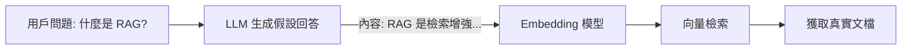

# 03. 索引與檢索優化 (Retrieval Optimization)

單純的向量檢索 (Vector Search) 往往無法應對所有查詢場景。為了提升 RAG 的準確率，我們需要引入混合檢索、重排序和查詢改寫等優化技術。

## 1. Hybrid Search (混合檢索)

混合檢索是指同時結合 **關鍵字檢索 (Keyword Search)** 和 **語義檢索 (Semantic Search)** 的結果。

### 1.1 BM25 (Sparse Vector) vs Dense Vector
*   **BM25 (Best Matching 25)**:
    *   **原理**：基於關鍵字匹配（詞頻 TF-IDF 的改進版）。它是 "Sparse Vector"（稀疏向量）的一種形式。
    *   **優勢**：精確匹配專有名詞、產品型號、人名、代碼片段。例如搜尋 "Error 503"，BM25 能精準找到包含 "503" 的文檔，而向量檢索可能會找到一堆關於 "Server Error" 但不是 503 的文檔。
*   **Dense Vector (Embedding)**:
    *   **原理**：基於語義相似度。
    *   **優勢**：理解同義詞和上下文。例如搜尋「蘋果的手機」，能找到包含 "iPhone" 的文檔，即使文中沒出現「蘋果」或「手機」。

### 1.2 為什麼需要混合檢索？
*   **互補性**：向量檢索擅長「泛化」，關鍵字檢索擅長「精確」。
*   **實作**：
    1.  分別進行 BM25 搜索和 Vector 搜索。
    2.  獲取各自的 Top-K 結果。
    3.  使用 **RRF (Reciprocal Rank Fusion)** 算法將兩組結果合併排序。

### 範例代碼 (Python 偽代碼)

```python
# 假設使用 Pinecone 或 Weaviate 等支援 Hybrid 的資料庫
results = index.query(
    vector=embedding_model.encode(query),
    sparse_vector=bm25_model.encode(query),
    top_k=10,
    alpha=0.5 # 0.5 代表 Keyword 和 Vector 權重各半
)
```

---

## 2. Re-ranking (重排序)

在初步檢索（Recall 階段）得到幾十個候選文檔後，我們需要一個更精細的模型來重新排序，把最相關的排在最前面。

### 2.1 Cross-Encoder 原理
*   **Bi-Encoder (用於檢索)**：將 Query 和 Document 分別獨立編碼成向量。計算速度快（可預先計算 Doc 向量），適合大規模檢索。但因為兩者獨立編碼，捕捉不到 Query 和 Doc 之間細微的交互關係。
*   **Cross-Encoder (用於重排序)**：將 Query 和 Document **拼接**在一起 (e.g., `[CLS] Query [SEP] Document [SEP]`) 送入 BERT 模型。模型能同時看到兩者，進行深度的注意力交互 (Full Self-Attention)。
    *   **優點**：準確率遠高於 Bi-Encoder。
    *   **缺點**：計算速度慢，無法預先計算。

### 2.2 檢索漏斗：召回率 (Recall) vs 準確率 (Precision)
*   **第一階段 (Retrieve)**：使用 Bi-Encoder (Vector) + BM25。目標是 **Recall (召回率)**，即「寧可抓錯，不可放過」。我們取 Top-50 或 Top-100。
*   **第二階段 (Re-rank)**：使用 Cross-Encoder。目標是 **Precision (準確率)**。對這 50 個候選者進行精細打分，選出 Top-5 給 LLM。

---

## 3. Query Rewrite (查詢改寫)

用戶的輸入往往是模糊、不完整或缺乏背景的。直接拿去檢索效果很差。

### 3.1 解決什麼問題？
*   **指代不明**：用戶問「它多少錢？」（上一輪對話在聊 iPhone 15）。直接搜「它多少錢」搜不到東西。
*   **多重意圖**：「比較一下 Python 和 Java」。需要拆解成「Python 的特點」和「Java 的特點」分別檢索。

### 3.2 HyDE (Hypothetical Document Embeddings)
HyDE 是一種巧妙的改寫技術。
*   **流程**：
    1.  **Generate**: 先讓 LLM 針對用戶的問題寫一篇「假設性的回答」(Fake Answer)。這個回答可能事實錯誤，但包含了很多相關的關鍵詞和語義模式。
    2.  **Encode**: 將這個「假設性回答」轉為向量。
    3.  **Retrieve**: 用這個向量去資料庫檢索真實文檔。
*   **原理**：雖然 LLM 不知道答案，但它知道「答案長什麼樣子」。用「假設答案」去搜「真實答案」，語義距離比用「問題」去搜「真實答案」更近。

### 範例：HyDE 流程


