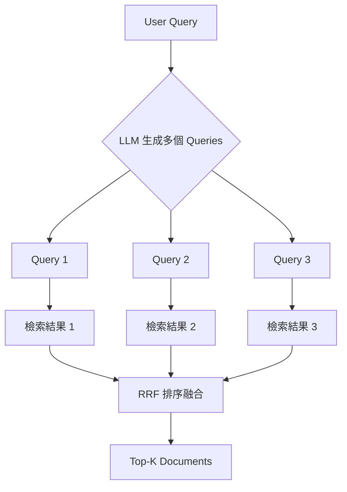
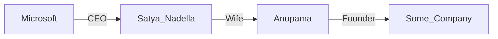

# 04. 進階 RAG 模式 (Advanced Patterns)

當基礎 RAG 無法滿足複雜推理或高質量生成需求時，我們需要引入更複雜的 Agentic 流程。

## 1. RAG-Fusion

RAG-Fusion 試圖解決「單一查詢視角受限」的問題。

### 1.1 多查詢生成 (Multi-query)
用戶的問題可能只是龐大知識體系的一個切面。RAG-Fusion 會利用 LLM 將用戶的一個問題，改寫成多個不同角度的查詢。
*   例如問：「氣候變化的影響？」
*   生成：「氣候變化對經濟的影響」、「氣候變化對海平面的影響」、「氣候變化的生物多樣性衝擊」。

### 1.2 RRF (Reciprocal Rank Fusion)
對每個生成的查詢都進行一次檢索，然後將所有結果合併。
*   **RRF 算法**：不依賴具體的分數（因為不同查詢的分數分布不同），而是依賴「排名」。
    $$ \text{score}(d) = \sum_{q \in Q} \frac{1}{k + \text{rank}(d, q)} $$
    *   如果一個文檔在多個查詢結果中都排名前列，它的最終得分就會很高。

---

## 2. Self-RAG (Self-Reflective RAG)

Self-RAG 引入了「自我反思」機制，讓模型學會說「這個檢索結果沒用」或者「我需要再查一次」。

### 2.1 核心流程：Retrieve -> Generate -> Critique
Self-RAG 訓練了一個 Critic 模型（或使用 Prompt 讓 LLM 扮演 Critic），在生成過程中進行打分：
1.  **Retrieval Token**: 判斷當前問題是否需要檢索？（有的問題憑常識就能答）。
2.  **Relevance Token**: 檢索回來的文檔真的和問題相關嗎？（過濾無效上下文）。
3.  **Support Token**: 生成的答案是否被文檔支持？（檢測幻覺）。
4.  **Utility Token**: 生成的答案是否有幫助？

### 2.2 如何篩選無效檢索？
如果是傳統 RAG，即使檢索全是垃圾，LLM 也會硬著頭皮回答。Self-RAG 則會：
*   如果 **Relevance** 低：丟棄該文檔，重新檢索或告訴用戶查不到。
*   如果 **Support** 低：修正答案，確保引用正確。

---

## 3. GraphRAG (基於知識圖譜的 RAG)

有些問題依靠「語義相似度」是搜不到的，特別是涉及複雜關係的問題。

### 3.1 實體 (Entity) 與 關係 (Relation)
GraphRAG 不再將文檔切成碎片存入 Vector DB，而是使用 LLM 提取文檔中的：
*   **實體**: 人名、地名、公司、概念 (Node)。
*   **關係**: A 是 B 的子公司、A 投資了 B、A 位於 B (Edge)。

### 3.2 解決「多跳躍推理 (Multi-hop Reasoning)」
*   **問題**: "微軟的 CEO 的老婆創辦了什麼公司？"
    *   文檔A: "Satya Nadella 是微軟 CEO。"
    *   文檔B: "Anupama 是 Satya Nadella 的老婆。"
    *   文檔C: "Anupama 創辦了某某公司。"
    *   **Vector Search** 很難一次把這三個文檔都湊齊，因為問題裡沒有 Satya 也沒有 Anupama。
*   **GraphRAG 解決方案**:
    *   從「微軟」節點跳到「CEO」節點 (Satya)。
    *   從「Satya」跳到「Wife」節點 (Anupama)。
    *   從「Anupama」跳到「Company」節點。
    *   沿著圖的邊進行遍歷 (Graph Traversal)，能精準找到答案路徑。

### GraphRAG 簡單示意

