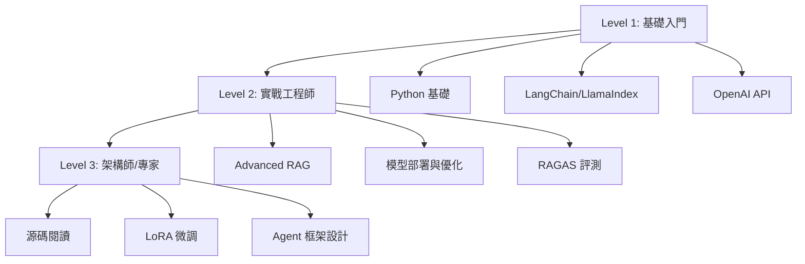

# 06-Career-Interview.md - 職涯與面試指南

> 本章節整理自 AI 應用開發工程師與算法工程師的真實面試題庫，助你通關大廠面試。

## 🗺️ AI Engineer 技能樹 (Roadmap)

從入門到專家的學習路徑：

---

## 🎯 核心面試題庫詳解

### 1. Python 基礎 (必考題)
*   **Q: List 和 Tuple 的區別？**
    *   **答**: List 是可變的 (Mutable)，Tuple 是不可變的 (Immutable)。Tuple 通常用於當作 Dictionary 的 Key 或保證數據不被修改。
*   **Q: 深拷貝 (Deep Copy) vs 淺拷貝 (Shallow Copy)**
    *   **答**: 淺拷貝只複製引用 (Reference)，修改子物件會影響原物件；深拷貝 (`copy.deepcopy`) 會遞歸複製所有子物件，完全獨立。
*   **Q: GIL (Global Interpreter Lock) 是什麼？**
    *   **答**: CPython 的機制，同一時間只能有一個 Thread 執行 Bytecode。解決方案：多進程 (Multiprocessing) 或使用 C 擴展。

### 2. RAG 實戰 (決勝題)
*   **Q: 如何解決 RAG 召回率低的問題？**
    *   **高手回答**:
        1.  **混合檢索 (Hybrid Search)**: BM25 (關鍵字) + Dense Vector (語義)。
        2.  **查詢改寫 (Query Rewrite)**: 使用 LLM 把用戶模糊問題改寫成精確問題。
        3.  **Chunking 優化**: 不要硬切，使用 Semantic Chunking 或父子索引 (Parent-Child Indexing)。
*   **Q: 檢索到了但回答不準 (幻覺) 怎麼辦？**
    *   **高手回答**:
        1.  **Re-ranking (重排序)**: 用 Cross-Encoder 過濾不相關的文檔。
        2.  **Prompt 優化**: 在 Prompt 中要求「只根據提供的上下文回答」。
        3.  **Self-RAG**: 讓模型自我反思「這個上下文有用嗎？」。

### 3. LLM 與微調 (加分題)
*   **Q: 什麼是 LoRA？為什麼要用它？**
    *   **答**: LoRA (Low-Rank Adaptation) 是凍結原模型參數，只訓練旁支的小矩陣。優點是顯存佔用極低，可以在消費級顯卡上微調大模型。
*   **Q: Transformer 的 Self-Attention 機制是什麼？**
    *   **答**: 讓模型在處理每個字時，都能關注句子中其他所有字的關聯性（例如 "it" 到底是指 "dog" 還是 "car"）。解決了 RNN 無法長距離記憶的問題。

---

## 💼 專案作品集建議

在履歷上，不要只寫「實作了一個 RAG 系統」。試試這樣寫：

*   ❌ **普通**: "使用 LangChain 和 OpenAI 建立了一個讀 PDF 的機器人。"
*   ✅ **優秀**: "開發企業級知識庫助手，針對 **PDF 表格解析** 進行優化（使用 PDFPlumber + Markdown 轉換），並引入 **Hybrid Search** 與 **BGE-Reranker**，將檢索召回率從 60% 提升至 **85%**。"

### 推薦專案題目
1.  **法律/醫療文檔問答**: 挑戰長文本與精確度。
2.  **個人知識庫 Agent**: 結合 Notion/Obsidian，證明你有串接 API 的能力。
3.  **多模態搜尋**: 可以搜尋圖片內容的 RAG。
