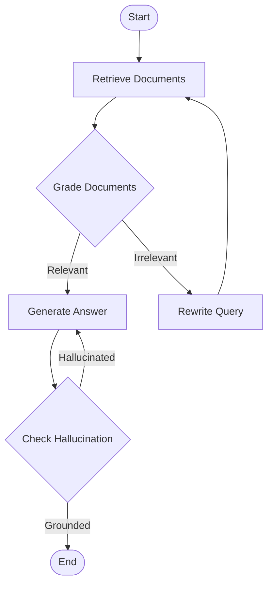

# 07. LangGraph 與 Agentic RAG

隨著 RAG 系統從簡單的「檢索-生成」線性流程演變為複雜的決策系統，傳統的 `AgentExecutor` 已難以滿足需求。2026 年的標準是使用 **LangGraph** 來構建具有狀態（Stateful）和迴圈（Cyclic）能力的 Agentic RAG。

## 1. 為什麼選擇 LangGraph？

在 LangChain 早期版本中，我們使用 `AgentExecutor` 來管理 Agent 的運行。它本質上是一個黑盒子，很難精細控制 Agent 的中間步驟或處理複雜的錯誤恢復。

**LangGraph** 的出現改變了這一切。它不是取代 LangChain，而是建立在 LangChain 之上，將 Agent 視為一個 **圖 (Graph)**。

### DAG vs. State Machine (狀態機)
*   **傳統 Chain (DAG)**: 有向無環圖 (Directed Acyclic Graph)。數據單向流動，一旦開始就必須走到結束，無法回頭循環。適合簡單的 RAG。
*   **LangGraph (State Machine)**: 允許「迴圈 (Cycles)」。Agent 可以根據當前狀態決定跳轉到哪個節點，甚至回到上一步重試。這對於 **Agentic RAG** 至關重要。

**為什麼 2026 年我們強調 Stateful Agent?**
因為真實世界的 RAG 需要「自我修正」。例如：檢索到的文檔不相關 -> 觸發重新檢索 -> 再次評分 -> 生成。這種 Loop 需要狀態記憶，而 LangGraph 原生支持這種模式。

## 2. LangGraph 核心概念

LangGraph 的設計深受 NetworkX 和 TensorFlow 等圖計算框架的啟發。

### 2.1 StateGraph (狀態圖)
這是整個應用的藍圖。你定義一個 `State` (通常是一個 TypedDict 或 Pydantic Model)，它在圖的各個節點之間傳遞。所有的節點都讀取這個 State，並將更新後的 State 寫回。

### 2.2 Nodes (節點) & Edges (邊)
*   **Nodes**: 執行的邏輯單元（Python 函數）。例如：`retrieve_documents`, `grade_documents`, `generate_answer`。
*   **Edges**: 連接節點的線。
    *   **Normal Edge**: A 做完直接去 B。
    *   **Conditional Edge**: A 做完，根據 A 的輸出決定去 B 還是 C（類似 `if-else`）。

### 2.3 Checkpointer (記憶與時光旅行)
LangGraph 內置了強大的持久化層 (**Checkpointer**)。它可以：
*   **Memory**: 記住跨對話的上下文。
*   **Human-in-the-loop**: 在關鍵步驟（如執行敏感操作前）暫停，等待人類批准後繼續。
*   **Time Travel**: 查看 Agent 過去的每一個步驟狀態，甚至修改 State 讓 Agent 從某個過去的點「重跑」。

## 3. Agentic RAG 實戰

我們將構建一個具備「自我修正 (Self-Correction)」能力的 RAG 系統。

### 3.1 流程設計
這個 Agent 不會拿到文檔就直接回答，而是會先「評分」。如果文檔質量太差，它會嘗試改寫問題重新檢索。



### 3.2 LangGraph Python 程式碼範例 (v1.24+)

以下代碼展示了如何定義上述流程。注意我們使用了 LCEL (LangChain Expression Language) 來構建節點內部的邏輯。

```python
from typing import TypedDict, List
from langgraph.graph import StateGraph, END
from langchain_core.documents import Document
from langchain_core.prompts import ChatPromptTemplate
from langchain_openai import ChatOpenAI
from langchain_core.output_parsers import StrOutputParser

# 1. 定義狀態 (State)
class GraphState(TypedDict):
    question: str
    generation: str
    documents: List[Document]

# 2. 定義節點 (Nodes)
def retrieve(state: GraphState):
    print("---RETRIEVE---")
    question = state["question"]
    # 假設 retriever 已經定義好
    documents = retriever.invoke(question)
    return {"documents": documents}

def grade_documents(state: GraphState):
    print("---CHECK RELEVANCE---")
    question = state["question"]
    documents = state["documents"]
    
    # 使用 LLM 進行評分 (LCEL)
    llm = ChatOpenAI(model="gpt-4o", temperature=0)
    prompt = ChatPromptTemplate.from_template(
        "You are a grader. Is this document relevant to: {question}? \nDoc: {document}"
    )
    chain = prompt | llm | StrOutputParser()
    
    # 簡化邏輯：只要有一個相關就通過，否則重寫
    score = chain.invoke({"question": question, "document": documents[0].page_content})
    
    if "yes" in score.lower():
        return "generate"
    else:
        return "rewrite"

def generate(state: GraphState):
    print("---GENERATE---")
    question = state["question"]
    documents = state["documents"]
    
    # 生成回答 (LCEL)
    prompt = ChatPromptTemplate.from_template(
        "Answer based on context: {context} \nQuestion: {question}"
    )
    llm = ChatOpenAI(model="gpt-4o", temperature=0)
    chain = prompt | llm | StrOutputParser()
    generation = chain.invoke({"context": documents, "question": question})
    return {"generation": generation}

def rewrite_query(state: GraphState):
    print("---REWRITE QUERY---")
    question = state["question"]
    # 改寫問題
    return {"question": f"Optimized: {question}"}

# 3. 構建圖 (Graph Construction)
workflow = StateGraph(GraphState)

# 添加節點
workflow.add_node("retrieve", retrieve)
workflow.add_node("generate", generate)
workflow.add_node("rewrite", rewrite_query)

# 定義流程與條件邊
workflow.set_entry_point("retrieve")

# 條件跳轉邏輯
def decide_to_generate(state: GraphState):
    # 這裡可以複用 grade_documents 的邏輯，或者將評分結果存在 state 中
    # 為簡化，假設這裡根據 state 中的標記跳轉
    # 實際應用中通常由 Node 返回某個 key，或在 Edge 函數中調用 LLM
    pass 

# 這裡我們使用更簡單的寫法：retrieve -> conditional_edge
workflow.add_conditional_edges(
    "retrieve",
    grade_documents, # 這個函數返回 "generate" 或 "rewrite"
    {
        "generate": "generate",
        "rewrite": "rewrite"
    }
)

workflow.add_edge("rewrite", "retrieve")
workflow.add_edge("generate", END)

# 4. 編譯與運行
app = workflow.compile()

# 運行圖
inputs = {"question": "LangGraph 是什麼?"}
for output in app.stream(inputs):
    for key, value in output.items():
        print(f"Finished running: {key}")
```

這個範例展示了 **Stateful Agent** 的強大之處：它不是一條直線走到黑，而是可以根據文檔的質量（State 的一部分）動態決定是否需要「回頭」重新檢索。

## 4. 參考資源 (References)

*   [LangChain v0.3 Docs](https://python.langchain.com/v0.3/docs/introduction/)
*   [LangGraph Docs](https://langchain-ai.github.io/langgraph/)
*   [LangSmith Tracing](https://docs.smith.langchain.com/)
